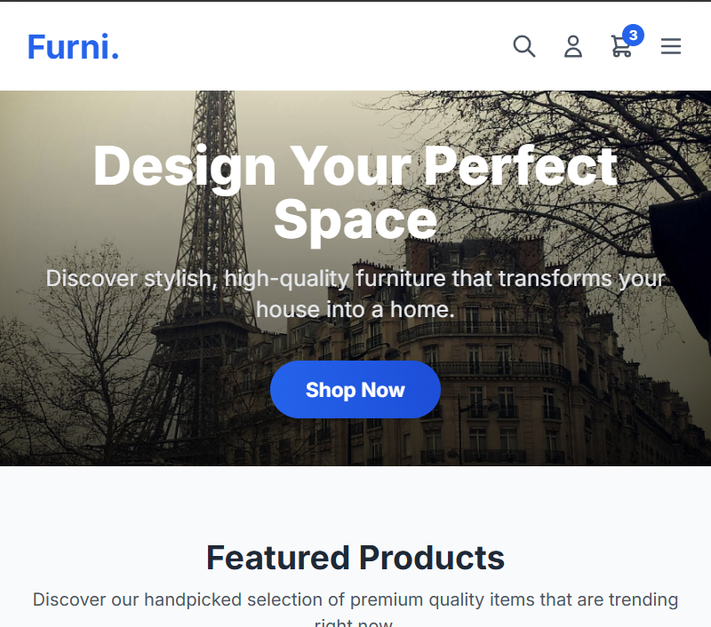

<h1 align="center">Furni. - E-Commerce Storefront UI</h1>

  A modern, responsive, and beautifully designed UI for a furniture e-commerce website.

  <a href="https://e-commerce-storefront-ui-v2.vercel.app/" target="_blank" rel="noopener noreferrer"><strong>View Live Demo</strong></a>

## 🚀 Overview

This project is a modern and visually appealing user interface for an e-commerce storefront, specifically for a furniture store named 'Furni.'. It features a clean design, smooth animations, and a responsive layout that works across various devices.

The application is built as a Single Page Application (SPA) with custom client-side routing to provide a seamless user experience without page reloads.

### Key Features:

- **Responsive Design**: Looks great on desktops, tablets, and mobile devices.
- **Interactive UI**: Engaging hover effects, animations, and transitions.
- **Component-Based Architecture**: Built with reusable React components.
- **Custom Routing**: A lightweight, custom-built router handles navigation.
- **Featured Sections**: Includes a hero section, featured products, categories, and a newsletter signup form.

## 📸 Screenshots

  A glimpse of the Furni. storefront UI in action, showcasing its responsive design and interactive elements.

<table width="100%">
  <tr>
    <td align="center"><strong>Desktop - Home Page</strong></td>
    <td align="center"><strong>Desktop - Product Hover</strong></td>
  </tr>
  <tr>
    <td></td>
    <td></td>
  </tr>
  <tr>
    <td align="center"><strong>Mobile - Home Page</strong></td>
    <td align="center"><strong>Mobile - Navigation Open</strong></td>
  </tr>
  <tr>
    <td></td>
    <td></td>
  </tr>
</table>

## 🛠️ Tech Stack

This project was built using the following technologies:

- **Frontend Framework**: React
- **Language**: TypeScript
- **Styling**: Tailwind CSS
- **Routing**: Custom client-side routing using the Browser History API.
